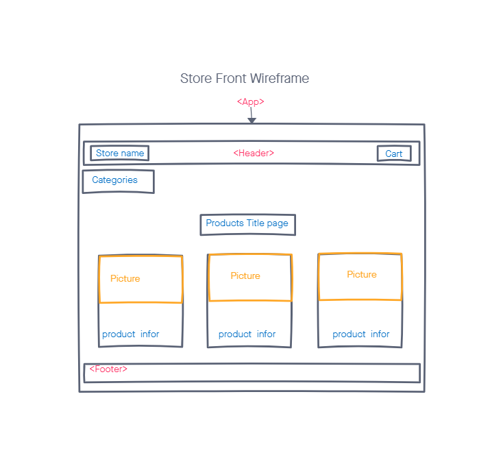

# storeFront
Virtual Store: creating an e-Commerce storefront using React with Redux

## Author: Louis Lassegue

## Stories
- User should expect to see a list of available product categories in the store so they can easily browse products
- User should be able to choose a category and see a list of all available products matching that category
- User want a clean and easy to use interface

## Development Process

### Phase 1: 
- [React](https://reactjs.org/) Application
  - setup the basic scaffolding of the application with basic behaviors.
  - Components
    - App - container for all sub-components of this application
    - Header - shows the name of your virtual store
    - Footer - shows your copyright and contact information
    - Categories:
      - list of all categories
      - Dispatches an action when one is clicked to “activate” it
    - Products - a list of products associated with the selected category

- [Redux](https://redux.js.org/)
  - State Management
    - Categories - State contain a list of categories as well as the active category
    - Products - State contain a list of all products
    - Active Category - State store active category

- [Material UI](https://material-ui.com/) 
  - For styling Components

### Phase 2: Adding the "Add to Cart" feature to application
- [React](https://reactjs.org/) Application
  - Add a "Cart" indicator to the header, (Cart (0))
  - Components
    - Cart - show the items in the user’s cart
    - SimpleCart:
      - short list (title only) of products in the cart
      - present at all times
      
- [Redux](https://redux.js.org/)
  - State Management
    - Cart:
      - State contain an array of products that have been added (all product details)
      - an action that will trigger the reducer to add the selected item to the cart
      - a reducer that adds the product to the array of items in state

### Phase 3:  Connecting our Virtual Store to a live API
- Persist changes to products based on cart activity.

### Phase 4: 

## Tests

## UML

## Setup
- [Github](https://github.com/mrloulass/storefront)
  - `fork` repository on Github
  - click green code and `clone` URL

- Project directory on local machine 
  - `git clone` cloned URL

- Install dependencies 
  - `npm install`
    - react-redux
    - redux
    - redux-devtools-extension
    - @material-ui/core
    - @material-ui/icons
    - react-router-dom
    - sass

- In the project directory, you can run:
  - `npm start`
    - Runs the app in the development mode.
    - Open http://localhost:3000 to view it in the browser.

  - The page will reload if you make edits.
  - You will also see any lint errors in the console.

  - `npm test`
    - Launches the test runner in the interactive watch mode.
    - See the section about running tests for more information.

## Links

